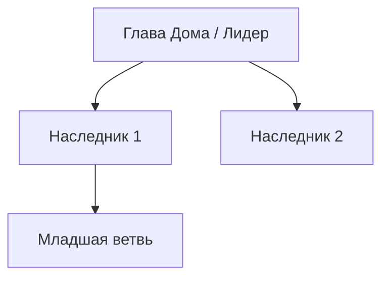
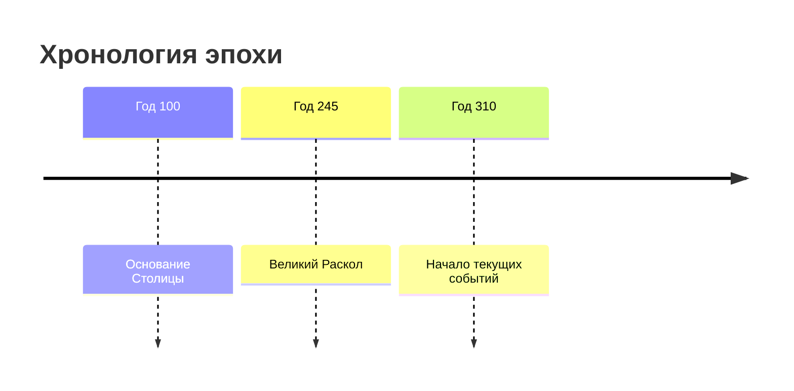

# Без названия

## Пример древа фракции или семьи

```mermaid
graph TD
    A[Глава Дома / Лидер] --> B[Наследник 1]
    A --> C[Наследник 2]
    B --> D[Младшая ветвь]
```

## Пример таймлайна

```mermaid
timeline
    title Хронология эпохи
    Год 100 : Основание Столицы
    Год 245 : Великий Раскол
    Год 310 : Начало текущих событий
```
